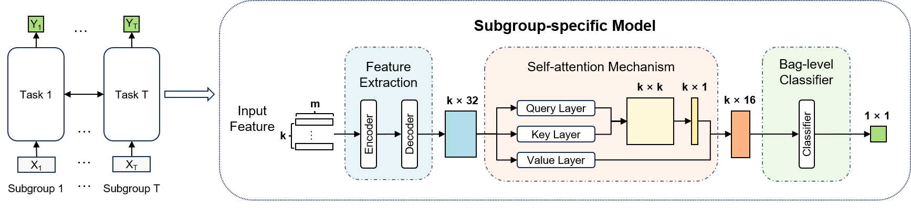

# FusionModel

## Content
- [Background and Framework](https://github.com/AadSama0404/FusionModel/blob/main/README.md#background-and-framework)
- [Installation and Usage](#https://github.com/AadSama0404/FusionModel/blob/main/README.md#installation-and-usage)

## Background and Framework
**Fusion Model** is an interpretable clone-based prognostic prediction model for patient cohorts comprising heterogeneous subgroups. It outputs a binary prediction indicating non-response (0) or response (1) as well as the corresponding probability of response between 0 and 1 which called the sample-score.


## Installation and Usage
**Clone the Repository**
```sh
git clone https://github.com/AadSama0404/FusionModel.git
```
**Install Dependencies**
```sh
pip install -r requirements.txt
```
**Data preprocessing and model training**
```sh
python data_preprocess.py
python main.py
```

## Examples and Analysis
